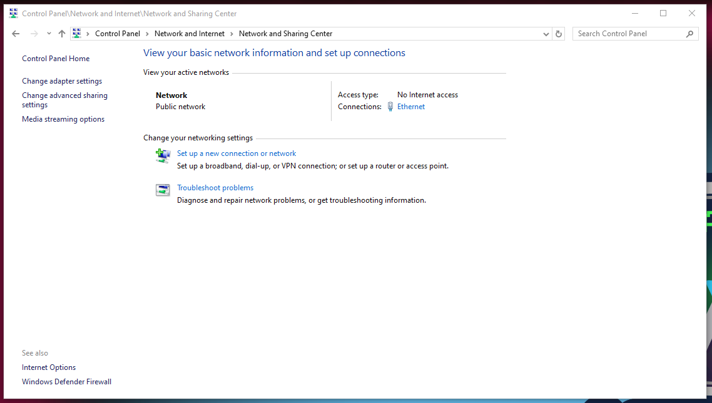
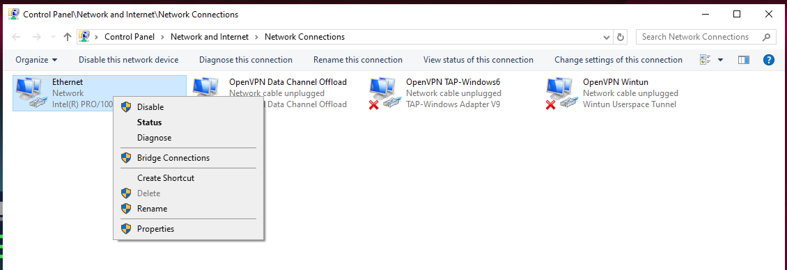
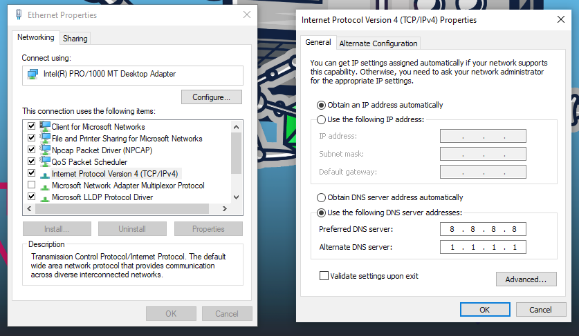

# Introduction 
Normally, installing a FlareVM won't mutate your network connection. However, for some reason, I wasn't able to access network inside the VM. This could have caused by one or a couple of reasons: 
- Non-fatal errors occured during installation (I was supposed to look at the screen during all process, but it took 6h to finish...)
- The recovery function of Windows got forced shut down to fulfill installation prerequisites, so it can not intervene and autofix the network issues 
- A driver "Other" was spotted to be missing after FlareVM completely finish its installation

# VirtualBox network setting walkthrough
You may like to switch to either NAT or Bridged Adapter. In the Adapter type, choose something along the line of "Intel... Desktop", or if you don't know what to choose, just leave the default option. 

If one of them does work, you may stop reading here. 

If you are not happy with only one work or both just does not provide you with internet connection, we are moving onto the next step.

# Device Manager 
Open Device Manager, and see if any of your driver got the yellow exclamation mark ⚠️ or something similar. If there is, this is a driver problem. 

# Install Driver in VirtualBox

The drivers for VirtualBox's virtual hardware are contained in the Guest Additions ISO image.

## Inserting Guest Additions CD Image

With your FlareVM running, click on the VirtualBox menu: Devices > Insert Guest Additions CD Image.

A virtual CD will be mounted inside your FlareVM. An auto-play dialog should pop up.

## Run the Installer

If the auto-play pops up, run VBoxWindowsAdditions.exe

If it doesn't, open File Explorer ("This PC"), and you will see a new CD drive called VirtualBox Guest Additions. Double-click to open it and run VBoxWindowsAdditions.exe.

After the program complete, reboot your machine.

## Verify After Reboot

After FlareVM restarts, go back to Device Manager.

Under Network adapters, you should now see a properly installed network adapter without any yellow exclamation mark.

Your network connection should now be active. Try both NAT and Bridged modes again. 

If it still does not work, we move on to the next step.


# Network refresh
Type this in your Administrator Terminal: 
```
ipconfig /flushdns
ping google.com
```
If it works, congrats, you may stop here ~
Else, let's continue.

# DNS Server 
1. Go to Control Panel > Network and Internet > Network and Sharing Center. On the left pane, click on Change Adapter Settings.


2. Then right-click on Ethernet > Properties 


3. In Ethernet Properties window, single-click on "Internet Protocol Version 4 (TCP/IPv4)", then click on the Properties button underneath it. 

4. On the pop-up window, check on "Obtain IP address automatically" and "Use the following DNS server address". We will use `8.8.8.8` (Google DNS) and `1.1.1.1` (Cloudflare DNS). Click OK and close all windows 


5. Type in Admin Terminal: 
```
ipconfig /release
ipconfig /renew
ipconfig /flushdns
```

6. Reboot


