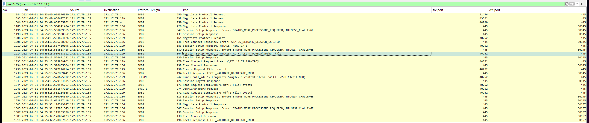

This is one of the HackTheBox's Sherlock - Reaper.

It's also one of the more terrible and sloppy write-up of mine, I don't recommend you reading this unless there really is no other choice. 

## Scenario
Our SIEM alerted us to a suspicious logon event which needs to be looked at immediately. The alert details were that the IP Address and the Source Workstation name were a mismatch. You are provided a network capture and event logs from the surrounding time around the incident timeframe. Corelate the given evidence and report back to your SOC Manager.

## Tasks
1. What is the IP Address for Forela-Wkstn001?
2. What is the IP Address for Forela-Wkstn002?
3. What is the username of the account whose hash was stolen by attacker?
4. What is the IP Address of Unknown Device used by the attacker to intercept credentials?
5. What was the fileshare navigated by the victim user account?
6. What is the source port used to log on to target workstation using the compromised account?
7. What is the Logon ID for the malicious session?
8. The detection was based on the mismatch of hostname and the assigned IP Address. What is the workstation name and the source IP Address from which the malicious logon occur?
9. At what UTC time did the malicious logon happen?
10. What is the share Name accessed as part of the authentication process by the malicious tool used by the attacker?

## Folder Structure 

```
Reaper
	security.evtx
	ntlmrelay.pcapng
```
Thus implying I am pretty much looking at an NTLM Relay Attack case.

## NTLM Relay Attack 

Please see this explanation from [0xdf](https://0xdf.gitlab.io/2024/08/22/htb-sherlock-reaper.html#ntlm-relay-attack) and [this video](https://youtu.be/He3PWdCQvzo), also. They would explain it better than I would, as Windows ain't my forte. 

## NTLM 


NTLM uses a challenge-response mechanism:

1. Client says "I want to authenticate"
2. Server sends a random **challenge** (nonce)
3. Client responds with a hash derived from their password + the challenge
4. Server (or a DC) verifies the response

## For this case
At this point, the victim has likely typoed some kind of UNC path for the domain controller as `\\D\` instead of `\\DC\`, and the attacker has responded to say that it is their IP.

It was LLMNR poisoning 

> A common technique is to poison LLMNR. When a host on a Windows domain tries to visit a host by DNS name, it first queries DNS, but if that fails, it tries link-local multicast name resolution (LLMNR).

### LLMNR

LLMNR (Link-Local Multicast Name Resolution) is a Windows protocol that acts as a fallback when DNS resolution fails. If a machine tries to resolve a hostname and the DNS server cannot find it, Windows automatically broadcasts an LLMNR query to every machine on the local network segment asking "does anyone know where this host is?"

NBT-NS (NetBIOS Name Service) is an older protocol that serves the same fallback purpose. Both are enabled by default on Windows.

The problem: any machine on the network can respond to these broadcasts — and Windows will trust the first response it gets.

## Overview 

_This section was mainly cited from HackTheBox write-up on this box itself. You can see the reference link at the end of the article_

We have three hosts: 001 (Task 1), 002 (Task 2), and Unknown - whose IP ends with 135, along with some random data - which is probably our threat actor.


Filtering `smb2` and the IP ends with 135 as source IP:



And at the same time, in event logs: 


In this specific event, we have multiple indicators that an NTLM relay attack did occur and authentication was conducted from the attacker's machine using stolen credentials.
The first indicator we see is that Security ID Says it is NULL SID and we have no Logon ID, LogonGUID is also null.
In network information, we can see that the source workstation says WKSTN002. In IP address we see 172.17.79.135. (Suspicious!)
Workstation002 has an IP address of 172.17.79.136, but it shows .135, which was an unknown device.
Another indicator we see is that the log-on process says it's NTLMSSP, which we confirmed from our network traffic analysis.
This confirms that the unknown device stole credentials from wkstn002 and used them to log on to wkstn001.

Therefore, from the logs, we can conclude that: 
- Arthur Kyle on Wkstn002 had hashes stolen by the attacker. One way this can happen is if the user had a typo when navigating to file share and the attacker was running responder to intercept traffic in the environment. (We'll discuss this later.)
- The hashes stolen by the attacker were then immediately relayed to the target system, which in our case, is Wkstn001. 
- The attacker authenticates and logs in to the target machine(Wkstn001 using the `arthur.kyle` account) and then dumps the SAM Hashes from the remote machine. This is the default behavior of [ntlmrelayx](https://github.com/fortra/impacket/blob/master/examples/ntlmrelayx.py) tool from impacket used for this purpose. After this, they can log on to the machine with the primary user account of that machine whose hash was dumped remotely.

## Task 1 
What is the IP Address for Forela-Wkstn001?


Answer: 172.17.79.129

## Task 2
What is the IP Address for Forela-Wkstn002?


Answer: 172.17.79.136

## Task 3 
What is the username of the account whose hash was stolen by attacker?


Answer: `arthur.kyle`

## Task 4
What is the IP Address of Unknown Device used by the attacker to intercept credentials?

According to the image above, it's `172.17.79.135`


## Task 5
What was the fileshare navigated by the victim user account?

Answer: `\\DC01\Trip`. It's apparently unclear why is this the correct answer (it make more sense when you actually look at the whole thing, but I still do not have a verbal explanation for this)


## Task 6 
What is the source port used to log on to target workstation using the compromised account?

Refer to the image in task 3. It's 40252

## Task 7
What is the Logon ID for the malicious session?

Refer to the image in task 3. It's 0x64A799

## Task 8 
The detection was based on the mismatch of hostname and the assigned IP Address. What is the workstation name and the source IP Address from which the malicious logon occur?


Answer: FORELA-WKSTN002, 172.17.79.135

## Task 9
At what UTC time did the malicious logon happen?

Look at the logon event happen right before the share file: 


At the section `TimeCreated SystemTime`, if the field ended with `Z`, it's UTC time. 
Answer: 2024-07-31 04:55:16

## Task 10 
What is the share name accessed as part of the authentication process by the malicious tool used by the attacker?

Answer: `\\*\IPC$`. It's in windows event logs. That `*` was supposed to be an IP `172.17.19.129`, it's unknown why it was logged that way. 

## Tips
If you feel stuck, maybe don't read others' write-up yet. Try HackTheBox hints first. I made that mistake the first time, as the hints were rather clear-cut, and it does get you to the desired destination.

## References 
- https://www.hackthebox.com/blog/ntlm-relay-attack-detection
- https://0xdf.gitlab.io/2024/08/22/htb-sherlock-reaper.html