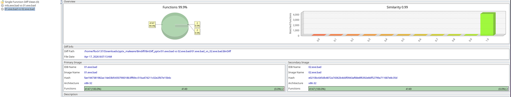
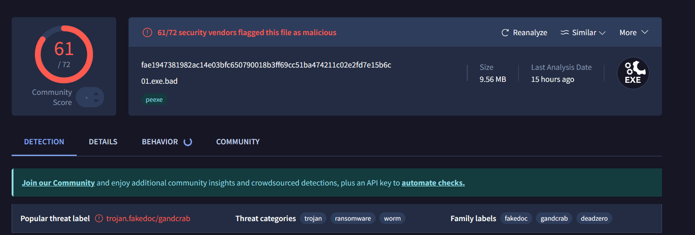
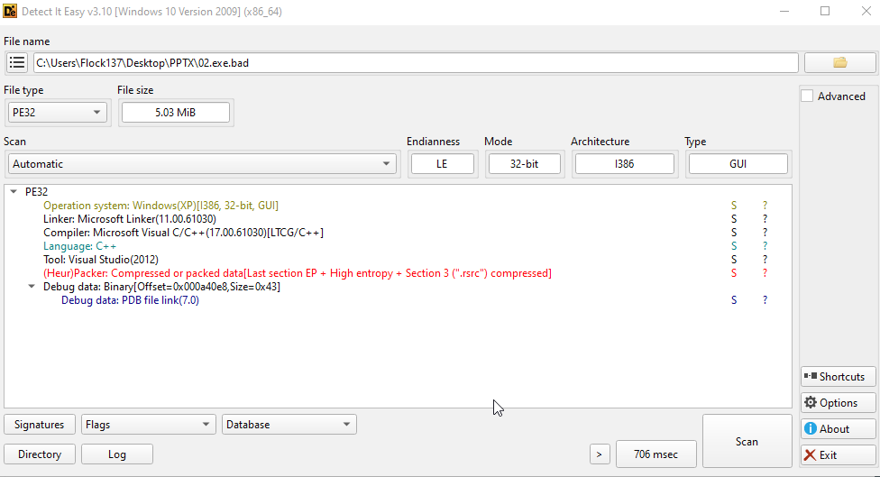

## Forewords
I found the malware inside my mom's ~~garage~~ direct message. Her friend asked her to print them something, 
which turns out to be two pieces of malware disguised as slideshow, namely `<file>.pptx.exe`. So I contain the file and try my hand on
analysing it. 

The repo of the artifacts and files found will be in this link: ...

This write-up will be writen in chronological order in how I perform the analysis. 

## Two files
I got 2 samples, to which, they are the same thing, as evidented by reading in decompiler, bindiff, dynamic analysis, and FLOSS show them as almost the 
same kind of binary.



## FLOSS/String 
At that point in time, I still thought that they were two different binaries, so I have two separated section for them. After this string section,
they will be treated as the same thing. For your infomation, I mainly use `01.exe.bad` for analysis. 

### 02.exe.bad 
We have three sections of strings 

```
 ────────────────────────── 
  FLOSS STACK STRINGS (13)  
 ────────────────────────── 

W0VA
u/]~W0VA{
W0VAx
?EW0VAx
proxy
tion
%appdata%\windrx.txt
urlmon.dll
.exe
http://45.141.233.6/32.exe
user32.dll
%s:Zone.Identifier
kernel32.dll

 ─────────────────────────── 
  FLOSS DECODED STRINGS (3)  
 ─────────────────────────── 

The requested URL returned error: 
16842810
254.254.254.254
```


```
%appdata%\RAC\svcsc.exe.config
svcsc.exe.config
http://wxanalytics.ru/net.exe.config
%appdata%\RAC\svcsc.exe
svcsc.exe
http://wxanalytics.ru/net.exe
.lost+found
DATA
.SERVER
.tmp
open
%SystemDrive%\
.exe
-ml.log
%appdata%\RAC
%appdata%\RAC\mls.exe
" -s
BFA31D7B-D1D1-40D5-A90C-A0909FFA0887
@0.1
Software\Microsoft\Windows\CurrentVersion\Run
Software\Microsoft\NET Framework Setup\NDP
```

```
mscoree.dll
R6008
- not enough space for arguments
R6009
- not enough space for environment
R6010
- abort() has been called
R6016
- not enough space for thread data
R6017
- unexpected multithread lock error
R6018
- unexpected heap error
R6019
- unable to open console device
R6024
- not enough space for _onexit/atexit table
R6025
- pure virtual function call
R6026
- not enough space for stdio initialization
R6027
- not enough space for lowio initialization
R6028
- unable to initialize heap
R6030
- CRT not initialized
R6031
- Attempt to initialize the CRT more than once.
This indicates a bug in your application.
R6032
- not enough space for locale information
R6033
- Attempt to use MSIL code from this assembly during native code initialization
This indicates a bug in your application. It is most likely the result of calling an MSIL-compiled (/clr) function from a native constructor or from DllMain.
R6034
- inconsistent onexit begin-end variables
DOMAIN error
SING error
TLOSS error
runtime error 
JR6002
- floating point support not loaded
Runtime Error!
Program: 
<program name unknown>
Microsoft Visual C++ Runtime Library
2.cmd
.bat
.com
```

### 01.exe.bad

```
%appdata%\RAC\svcsc.exe.config
svcsc.exe.config
http://wxanalytics.ru/net.exe.config
%appdata%\RAC\svcsc.exe
svcsc.exe
http://wxanalytics.ru/net.exe
.lost+found
DATA
.SERVER
.tmp
open
%SystemDrive%\
.exe
-ml.log
%appdata%\RAC
%appdata%\RAC\mls.exe
" -s
BFA31D7B-D1D1-40D5-A90C-A0909FFA0887
@0.1
Software\Microsoft\Windows\CurrentVersion\Run
Software\Microsoft\NET Framework Setup\NDP
v2.0.50727
v3.0
v3.5
v4\Client
v4\Full
v4.0\Client
v4.0\Full
Version
%temp%\
DATA
Hinh 04-01
```


```

 ────────────────────────── 
  FLOSS STACK STRINGS (13)  
 ────────────────────────── 

W0VA
u/]~W0VA{
W0VAx
?EW0VAx
proxy
tion
%appdata%\windrx.txt
urlmon.dll
.exe
http://45.141.233.6/32.exe
user32.dll
%s:Zone.Identifier
kernel32.dll

 ─────────────────────────── 
  FLOSS DECODED STRINGS (3)  
 ─────────────────────────── 

The requested URL returned error: 
16842810
254.254.254.254
```

### Discussions on strings found in both binaries


... <Give comment about the string snippet above>


**Key APIs found in static strings:**

- `VirtualAlloc`, `VirtualProtect` — memory manipulation
- `CreateRemoteThread` equivalent behavior likely via `ShellExecuteW`
- `RegSetValueExW`, `RegOpenKeyExW` — registry writes (persistence)
- `CreateMutexW` / `ReleaseMutex` — mutex for single-instance check
- `ConnectNamedPipe`, `CreateNamedPipeW` — IPC/pipe communication
- `IsDebuggerPresent` — anti-debug check
- `urlmon.dll` — used to download files from the internet
- `%s:Zone.Identifier` — likely deleting the Zone.Identifier ADS to remove the "downloaded from internet" mark on dropped files


## Anti Reverse Engineering (RE) functions

**VirusTotal**

```
iGetAdapterAddresses
GetTickCount
GetTickCount64
```

**Static** 

```
IsDebuggerPresent
```

Therefore, to save time, I decided not to use a debugger. 


## VirusTotal Result



From this result, I search up a bit, and temporarily concluded that it is belong to the FakeDoc family, which didn't help much, unfortunately,
due to the shear varieties within this group of malware. 


## Detect-It-Easy



We can see that: 
- This is PE32 binary, with compatibility from WindowsXP and above (i386).
- Entropy points is 6, which is quite high, but since the binary was embed into a document (pptx), i'm not too sure about this result. 
- Although the it was said that this binary is packed, it... doesn't seem to be as such, as I don't find myself spending too much time finding way in.


## Other comments before break 

- Why do you need port 23 (telnet), hmmm? -> It was for some kind of telecomunication to a server.
- Binary Ninja read the supposedly packed binary very well, as the decompiled code seem to look rather clear. 
- However, there are sure way too many things to read.

## Decompilation
As stated above, I use Binary Ninja Free, as it was the most readable decompiler out of everything that I tried.


