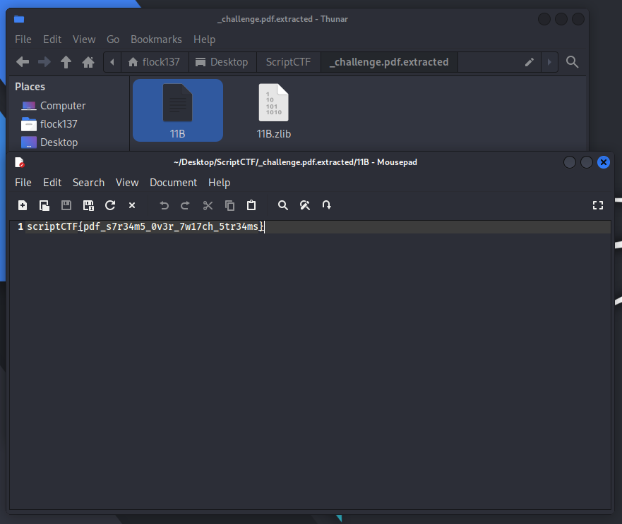
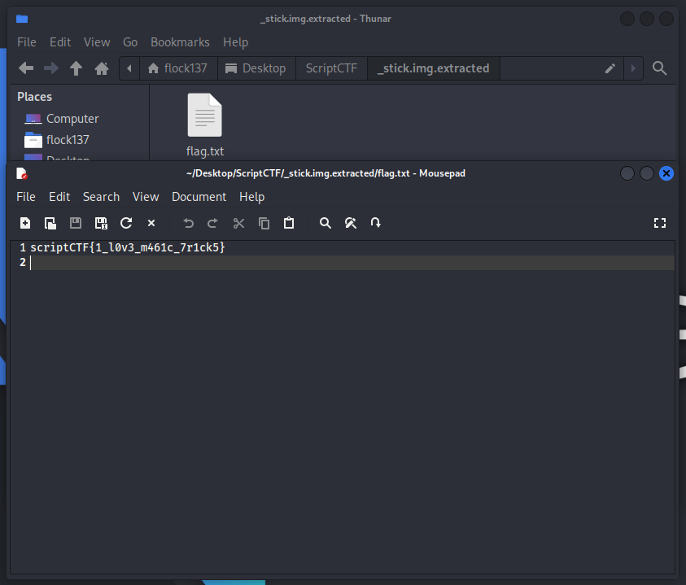
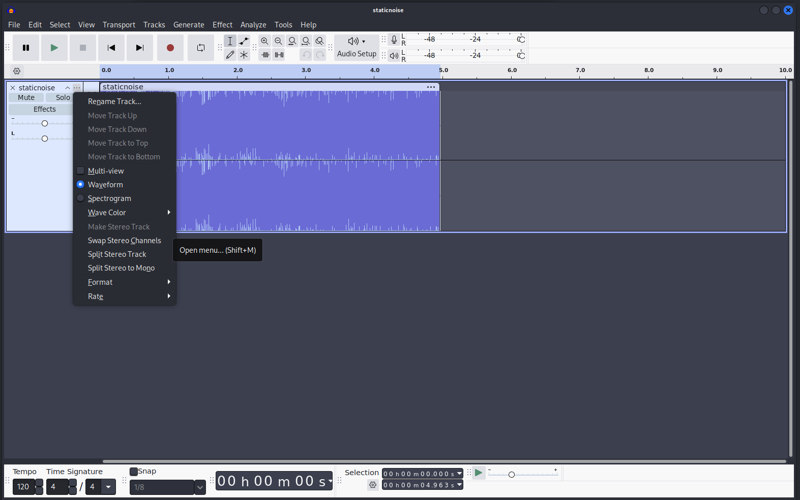
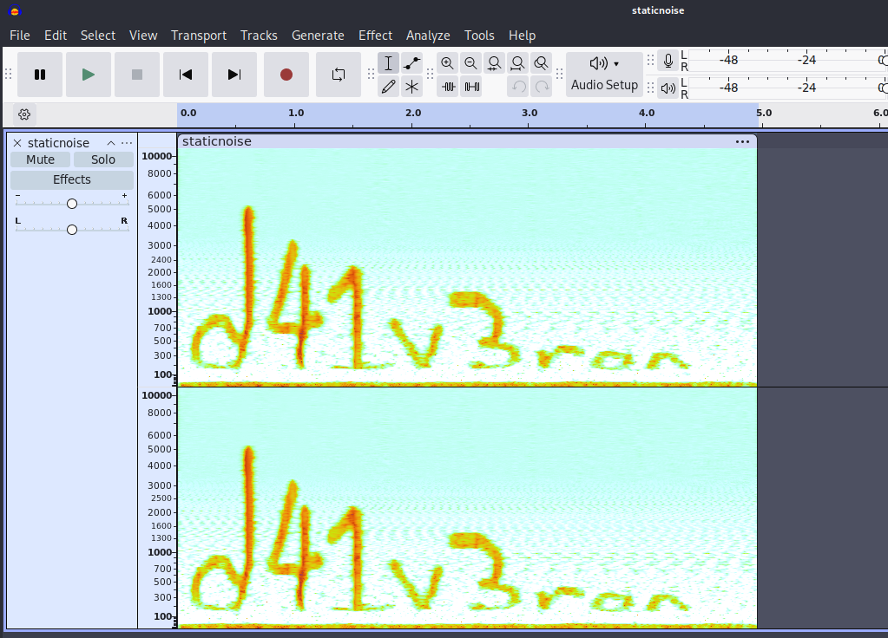

# pdf (Author: Connor Chang)
Description: so sad cause no flag in pdf

The challenge attachment can be found here: https://github.com/scriptCTF/scriptCTF2025-OfficialWriteups/blob/main/Forensics/pdf/attachments/challenge.pdf

For this challenge, you can open up Firefox to view the hint in the given PDF, but for this approach, we won't need to use it. All we have to do is using `binwalk`
```
binwalk -e challenge.pdf 
```
In the extracted folder, click on (or `cat`) the text file (`11B` or something similar), the flag is in there



# diskchal (Author: Connor Chang)
Description: i accidentally vanished my flag, can u find it for me

Attachment: https://github.com/scriptCTF/scriptCTF2025-OfficialWriteups/blob/main/Forensics/diskchal/attachments/stick.img

After doing some basic investigation on the image, I was bored and decided to use `binwalk` according to... gut feelings. I somehow found the `flag.txt` and it effectively ended the challenge. 



# Just some Avocado (Author: Connor Chang)
Description: just an innocent little avocado!

Attachment: https://github.com/scriptCTF/scriptCTF2025-OfficialWriteups/blob/main/Forensics/JustSomeAvocado/attachments/avocado.jpg


By instinct, I do a `binwalk -e` again and found a zip file with password. Bruteforce it using `john` or `hydra` with the wordlist `rockyou.txt` (you can find it on github). 
Inside the file, there's another zip file which contain our flag and a `staticnoise.wav`, in which by listening to it, I figure out this is a steganography.

Open `staticnoise.wav` in Audacity, click on the `...` on the left pane, tick on "spectrogram" 


And, you got the flag!


