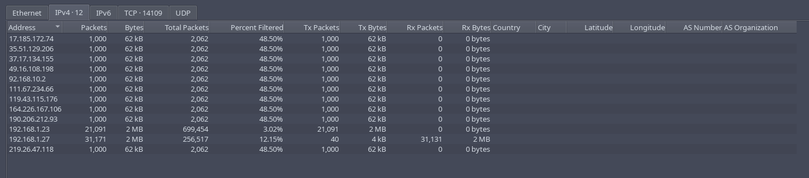
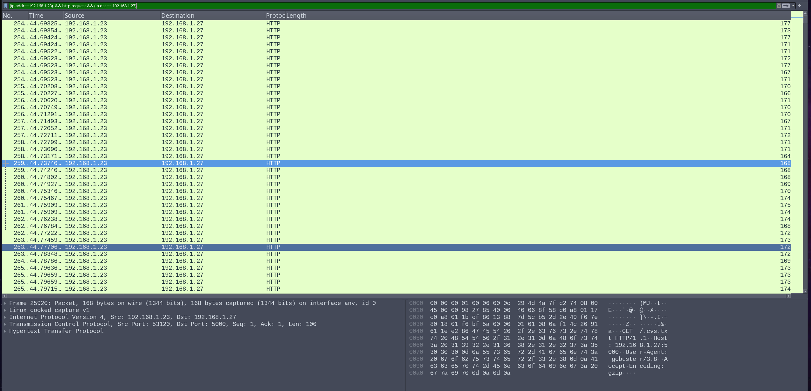

# Void Step 

### How many decoy hosts are randomized in this recon evasion technique 
Answer: 12 


In Wireshark filter:
```
(tcp.flags.syn == 1 && tcp.flags.ack == 0 ) && (ip.dst == 192.168.1.27)
```

Explaination: 
- Destination IP is found through manual inspection. 
- For faster port scanning, we (or the attacker) perform the half-open scan, where SYN=1, ACK=0 (means: send only, no need response).

Go to Statistics > Endpoints > IPv4, count the addresses, then minus 1 (the destination address, which we need to exclude).



### What is the real attacker IP address?
Answer: 192.168.1.23

The rest is either the destination ip or decoys. It seems like traffic from a person because it seems stands out compare to other traffics, through manual inspection. 

### How many open ports did the attacker find? 

Add `&& (ip.addr==192.168.1.23)` to previous filter in the first question.

There are 4. Look at these collumns: 

| Bits/s A->B | Bits/s B->A |
| ----------- | ----------- |

If they have numbers inside, that's your open ports.

Ports open: 22, 5000, 8000, 6789

Filter used: `(tcp.dstport == 22 || tcp.dstport == 5000 || tcp.dstport == 8000 || tcp.dstport == 6789)`

### What web enumeration tool did attacker use?
Filter: 
```
(ip.addr==192.168.1.23) && http.request && (ip.dst == 192.168.1.27)
```



It was GoBuster.

### What's the first endpoint discovered by the attacker?
Answer: /About 

Found by manual inspection.

Filter used: 
```
(ip.addr==192.168.1.23) && http.request.method==GET && (ip.dst == 192.168.1.27)
```

### First file extension test during enumeration
Answer: .html from .bash_history.html

Found by manual inspection of chronological events. The first file appeared was `.bash_history.html`


### Full vulnerable request parameter used in the attack 
Answer: `file`

```
http://192.168.1.27:5000/read?file=%2Fhome%2Fzoro%2F.ssh%2Fauthorized_keys
```

### What is the username discovered by the attacker?
Answer:zoro. As above shown.

### What time did the attacker start bruteforcing for ssh? 
Tried all the reasonable ones, but none are correct. Chances are the destination port was not 22.