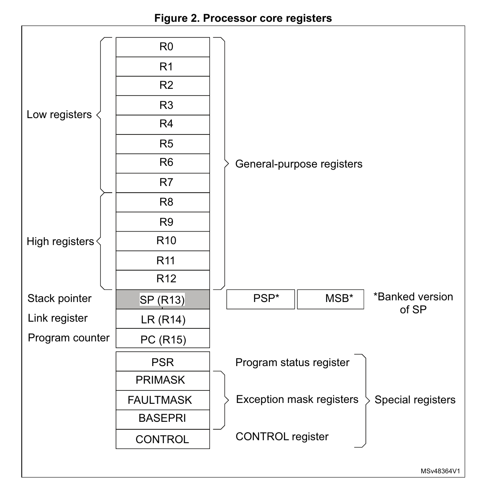

---
title: Understanding ARM dissassembly Pt. 2 
date: 2026-10-01
draft: false
showToc: true 
tags:
  - Assembly
  - Hardware
  - stm32
  - ARM
---

### Introduction 
I had some confusion over the semantic of the word "disassembly". So this is the next part to make up for that.  

For more details on the board I'm operating on, please refer to [part 1](https://flock137.github.io/posts/arm_disasm/) and the [manual repo](https://github.com/Flock137/STM32_manual).

### main.c

```c
#define STM32F103xB
#include "stm32f1xx.h"

void delay(volatile uint32_t count) {
    while(count--);
}

int main(void) {
    // Enable GPIOC clock
    RCC->APB2ENR |= RCC_APB2ENR_IOPCEN;

    // Configure PC13 as output
    GPIOC->CRH = (GPIOC->CRH & ~0xFF000000) | 0x33000000;

    while(1) {
        GPIOC->ODR ^= (1 << 13);  // Toggle
        delay(2000000);
    }
}
```

### Binary Ninja Decompiled Output

```c
08000000    void delay(uint32_t volatile count) __pure
08000000    {
08000000        uint32_t var_c = count;
08000012        uint32_t i;
08000012
08000012        do
08000012        {
0800000a            i = var_c;
0800000e            var_c = i - 1;
08000012        } while (i);
08000000    }

08000020    void main() __noreturn
08000020    {
08000020        *(uint32_t*)0x40021018 |= 0x10;
0800003e        *(uint32_t*)0x40011004 = (
0800003e            *(uint32_t*)0x40011004 & 0xffffff)
0800003e            | 0x33000000;
0800003e
0800004a        while (true)
0800004a            *(uint32_t*)0x4001100c ^= 0x2000;
08000020    }

// Literal pool (constants stored in flash)
08000058  int32_t data_8000058 = 0x40021000  // RCC base
0800005c  int32_t data_800005c = 0x40011000  // GPIOC base
08000060  int32_t data_8000060 = 0x1e8480    // 2000000 decimal
```


### Disassembly

```asm
08000000    void delay(uint32_t volatile count) __pure

08000000  80b4       push    {r7} {__saved_r7}         ; save r7 (frame pointer)
08000002  83b0       sub     sp, #0xc                  ; allocate 12 bytes stack 
08000004  00af       add     r7, sp, #0 {var_10}       ; sp = r7
08000006  7860       str     r0, [r7, #4] {var_c}      ; store count at var_c 
08000008  00bf       nop                               

0800000a  7b68       ldr     r3, [r7, #4] {var_c}      ; r3 = var_c (current count)
0800000c  5a1e       subs    r2, r3, #1                ; r2 = r3 - 1
0800000e  7a60       str     r2, [r7, #4] {var_c}      ; r2 = var_c 
08000010  002b       cmp     r3, #0                    ; compare r3 to 0
08000012  fad1       bne     #0x800000a                ; "Branch to <address> if Not Equal"
													   

08000014  00bf       nop
08000016  00bf       nop
08000018  0c37       adds    r7, #0xc {__saved_r7}     ; r7 += 12
0800001a  bd46       mov     sp, r7                    ; sp = r7 (deallocate)
0800001c  80bc       pop     {r7} {__saved_r7}         ; pop out of stack
0800001e  7047       bx      lr                        ; return 


08000020    void main() __noreturn

08000020  80b5       push    {r7, lr} {var_4} {var_8}                         ; save frame pointer + ret addr as var_4 + var_8
08000022  00af       add     r7, sp, #0 {var_8}                               ; frame ptr 

;Enable GPIOC clock
;RCC->APB2ENR |= RCC_APB2ENR_IOPCEN

08000024  0c4b       ldr     r3, [pc, #0x30]  {data_8000058}  {0x40021000}    ; r3 = 0x40021000 (RCC base)
08000026  9b69       ldr     r3, [r3, #0x18]  {0x40021018}                    ; r3 = RCC->APB2ENR
08000028  0b4a       ldr     r2, [pc, #0x2c]  {data_8000058}  {0x40021000}    ; r2 = 0x40021000
0800002a  43f01003   orr     r3, r3, #0x10                                    ; Set bit 4 (IOCPEN)
0800002e  9361       str     r3, [r2, #0x18]  {0x40021018}                    ; Store r3 = r2

;Config PC13 as output
;GPIOC->CRH = (GPIOC->CRH & ~0xFF000000) | 0x33000000
;*(uint32_t*)0x40011004 = (*(uint32_t*)0x40011004 & 0xffffff) | 0x33000000;

08000030  0a4b       ldr     r3, [pc, #0x28]  {data_800005c}  {0x40011000}    
08000032  5b68       ldr     r3, [r3, #4]  {0x40011004}                       
08000034  23f07f43   bic     r3, r3, #0xff000000                              
08000038  084a       ldr     r2, [pc, #0x20]  {data_800005c}  {0x40011000}    
0800003a  43f04c53   orr     r3, r3, #0x33000000                              
0800003e  5360       str     r3, [r2, #4]  {0x40011004}                       

;GPIOC->ODR ^= (1 << 13)

08000040  064b       ldr     r3, [pc, #0x18]  {data_800005c}  {0x40011000}
08000042  db68       ldr     r3, [r3, #0xc]  {0x4001100c}
08000044  054a       ldr     r2, [pc, #0x14]  {data_800005c}  {0x40011000}
08000046  83f40053   eor     r3, r3, #0x2000
0800004a  d360       str     r3, [r2, #0xc]  {0x4001100c}

;delay
0800004c  0448       ldr     r0, [pc, #0x10]  {0x1e8480}  {data_8000060}                  ;r0 = 0x1e8480 (2000000)
0800004e  fff7d7ff   bl      #delay                                                       ;delay(2000000)
08000052  00bf       nop
08000054  f4e7       b       #0x8000040                                                   ;Jump back to loop's start point


08000056                                                                    00 bf         ;nop                                        ..


08000058  int32_t data_8000058 = 0x40021000      ; RCC base
0800005c  int32_t data_800005c = 0x40011000      ; GPIOC base
08000060  int32_t data_8000060 = 0x1e8480        ; decimal of 2000000 (2 sec)

```


### Processor core registers 

The variables' names make more sense when you read the figure below. 

For more details, refer to the [Programming Manual](https://github.com/Flock137/STM32_manual/blob/main/pm0056-stm32f10xxx20xxx21xxxl1xxxx-cortexm3-programming-manual-stmicroelectronics.pdf), which have full details on the Instruction Set. 




